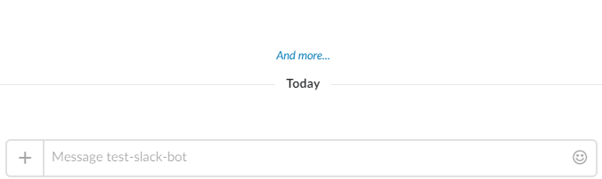

SlackReporting
==============

Small utility library to report last state of any long-running process to Slack.



Usage
-----

First you should initialize a `SlackReporter` object:

```csharp
var options = new SlackReporterOptions
{
    AccessToken = "YOUR_SLACK_ACCESS_TOKEN",
    Channel = "CHANNEL_OR_USERNAME",  // e.g. "#my-test-channel" or "#my_user_name"
};

var reporter = options.CreateReporter();
```

After that you may post a new message with initial status text:

```csharp
using(var message = reporter.BeginMessage("Initial status test"))
{
    // ...
}
```

This will post a message into Slack. This message can be updated:

```csharp
message.Update("Updated status text");
```

Once you dispose an instance of `SlackMessage` the status message will be deleted. Set `SlackReporterOptions.DeleteMessageAfterwards` to `false` to disable message deletion.

> Please note that you can use any ordinary Slack markup within both initial and updated statuses.

Additinally you may set bot's user name and icon via `SlackReporterOptions.Username` and `SlackReporterOptions.Icon` properties.

Compiling
---------

Run `build.ps1` in your terminal:

```shell
./build.ps1
```

This command will produce nuget packages and put then into `/artifacts` directory.


License
-------

This project is licensed under [MIT License](LICENSE).